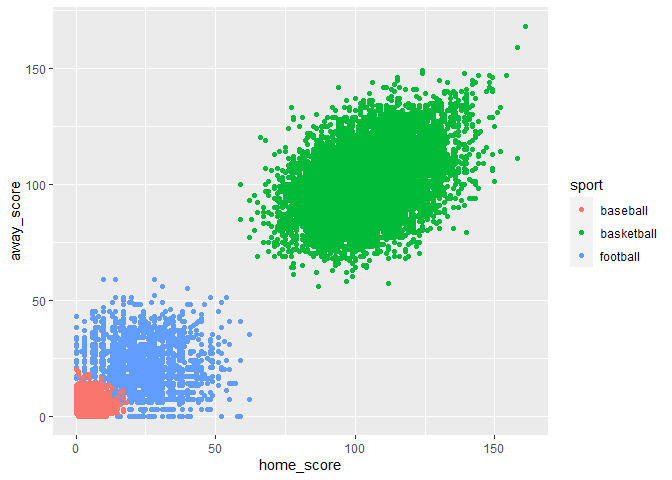

An unnecessarily complicated way of classifying sports based on the
final score
================
Andrew Breza

## “Iowa wins\!”

I’m always happy when I get this text from my dad. He’s a superfan of
his alma mater, the University of Iowa. I was excited to see that the
Hawkeyes football team had pulled out a victory.

“Final score 76-103.”

I scratch my head for a moment before realizing that he’s talking about
the Iowa men’s basketball team, not the football team. This got me
thinking. How hard would it be to classify my father’s three favorite
sports based only on the final score? In addition to cheering for
Hawkeyes football and basketball, he’s a lifelong fan of the Chicago
Cubs, a Major League Baseball team.

I’m a data scientist on paternity leave. I write this from my treadmill
desk carrying my won’t-sleep-unless-being-walked daughter in an
Ergobaby. I believe that a thing worth doing is worth overdoing, so
let’s overengineer the heck out of this question before she wakes up.
(EDIT: I ended up devoting several naptimes to this project.)

I gathered a dataset of final scores for the three sports from 2009 into
2020 and saved it as sport.csv. Let’s take a look.

``` r
sport <- read_csv(
  "sport.csv", col_types = 
  cols(
    home_score = col_integer(),
    away_score = col_integer(),
    sport = col_character()
  )
)

sport
```

    ## # A tibble: 41,423 x 3
    ##    home_score away_score sport   
    ##         <int>      <int> <chr>   
    ##  1         13         10 football
    ##  2         20         34 football
    ##  3         45         27 football
    ##  4         21         34 football
    ##  5          7         24 football
    ##  6         14         12 football
    ##  7          7         12 football
    ##  8         10         38 football
    ##  9         38         24 football
    ## 10         19          7 football
    ## # ... with 41,413 more rows

``` r
sport %>% 
  group_by(sport) %>% 
  summarise(n = n(), home_mean = mean(home_score), away_mean = mean(away_score))
```

    ## `summarise()` ungrouping output (override with `.groups` argument)

    ## # A tibble: 3 x 4
    ##   sport          n home_mean away_mean
    ##   <chr>      <int>     <dbl>     <dbl>
    ## 1 baseball   24300      4.52      4.25
    ## 2 basketball 14176    104.      101.  
    ## 3 football    2947     23.8      21.5

Three immediate thoughts: 1. There are a lot more baseball games and a
lot fewer football games. 2. The average scores of all three sports are
different. 3. The home field advantage appears to exist in all three
sports.

The averages are different but what about the distributions? Let’s plot
the data and see how much the scores from different sports appear to
overlap.

``` r
ggplot(sport, aes(x = home_score, y = away_score, color = sport)) +
  geom_point()
```

<!-- -->

3.1415927

``` julia
1+1
```

    ## 2
